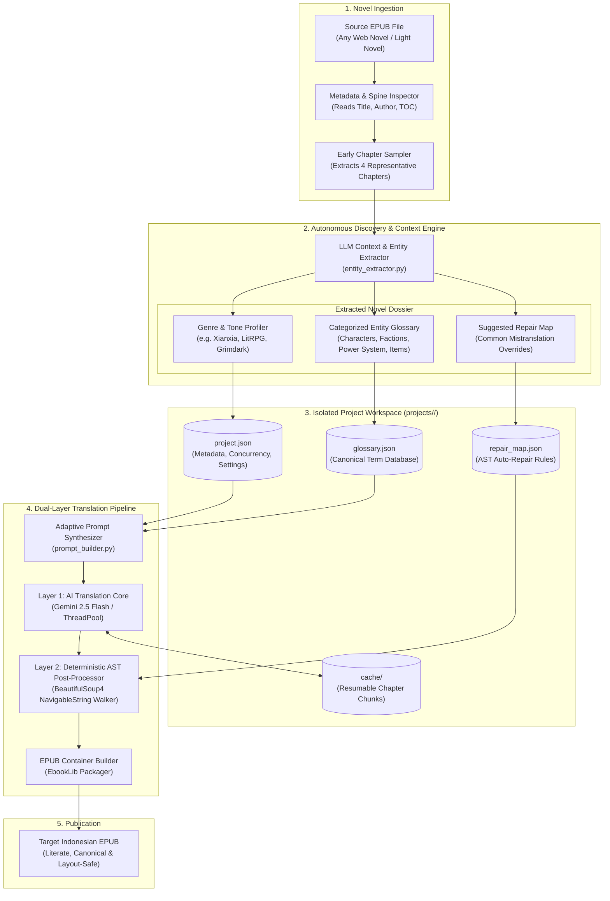

# 🌐 Universal Novel EPUB Translator

<div align="center">

[](LICENSE)
[](https://python.org)
[](#-multi-project-architecture)
[](https://ai.google.dev/)
[](https://www.crummy.com/software/BeautifulSoup/)
[](https://www.w3.org/publishing/epub3/)

<p align="center">
  <b>A comprehensive, multi-project AI translation platform and interactive TUI console for web novels and light novels in any genre. Features autonomous novel context & entity extraction, genre-adaptive literary prompt synthesis, isolated project workspaces, and deterministic XML AST DOM auto-repair.</b>
</p>

[Key Features](#-key-features) • [System Architecture](#-multi-project-architecture) • [Interactive TUI & CLI](#-interactive-tui--headless-cli) • [Project Schema](#-project-workspace-schema) • [Quick Start](#-quick-start) • [Troubleshooting](#-troubleshooting--faq) • [License](#-license)

</div>

---

## 📖 Executive Summary

Translating foreign web novels (Xianxia, Wuxia, LitRPG / Dungeon Hunter, Western Fantasy, or Cyberpunk) into natural, literate Indonesian poses unique challenges:
- **Genre-Specific Terminology**: Cultivation realms (*Qi Condensation, Foundation Establishment*), Hunter classifications (*S-Rank, Awakener, Gate*), or sectarian seniority titles (*Senior Brother, Martial Uncle*) require strict consistency across hundreds of chapters.
- **Tone & Prose Disconnection**: Generic machine translation flattens stylistic prose, reducing epic fantasy or grimdark narration into robotic, literal sentences.
- **Project Cross-Pollination**: Working on multiple books simultaneously causes glossary collisions and cache pollution if terminology is not strictly sandboxed.

**Universal Novel EPUB Translator** solves this with an **Isolated Multi-Project Architecture**:
1. **Autonomous Entity & Context Discovery**: Analyzes early chapters of any EPUB to automatically deduce genre, tone, character names, factions, artifacts, and cultivation systems without manual data entry.
2. **Adaptive Literary Prompt Synthesizer**: Generates genre-tailored system instructions matching the novel's specific tone (Xianxia, LitRPG, Victorian, Sci-Fi).
3. **Dual-Layer Defense & AST XML DOM Repair**: Translates via Google Gemini (or OpenAI-compatible APIs) with resumable paragraph caching, followed by deterministic BeautifulSoup DOM traversal that replaces canonical terms safely without breaking XML tags or CSS layouts.

---

## 🏗️ Multi-Project Architecture



---

## ✨ Key Features

### 📁 1. Sandboxed Multi-Project Workspaces
Every novel is allocated an isolated directory under `projects/<slug>/`:
- `project.json`: Novel metadata, detected genre, target language, and concurrency settings.
- `glossary.json`: Entity database partitioned into Characters, Organizations, Locations, Power Systems, Artifacts, and Terminology.
- `repair_map.json`: Deterministic post-processing dictionary for Layer 2.
- `cache/`: Resumable translation cache preventing redundant token expenditure across sessions.

### 🤖 2. Autonomous Context & Entity Discovery
Drop in an unread EPUB. The system:
1. Samples the first 4 chapters.
2. Prompts the LLM to inspect cultural markers, dialogue conventions, and power rankings.
3. Automatically categorizes major factions, protagonist aliases, magic systems, and translates them into canonical Indonesian equivalents.

### 🎭 3. Genre & Tone Adaptive Prompt Synthesis
Dynamically adapts system prompts based on the novel's detected genre:
- **Xianxia / Wuxia**: Respects Taoist cultivation realms (*Dantian, Nascent Soul*), martial brotherhood titles (*Senior Brother, Martial Aunt*), and esoteric technique names.
- **LitRPG / System Hunter**: Preserves status windows, stat arrays, skill rank formats (`[S-Rank Skill: Shadow Extraction]`), and dungeon terminology.
- **Victorian / Grimdark**: Elevates prose with classical, atmospheric diction, preserving deities, arcane rites, and eldritch relics.
- **Sci-Fi / Cyberpunk**: Safeguards cybernetic augmentations, AI designations, megacorporation names, and dystopian jargon.

### 🛡️ 4. Zero-Corruption XML AST DOM Auto-Repair
Layer 2 parses each chapter's XHTML into an Abstract Syntax Tree using `BeautifulSoup4` with `lxml-xml`:
- **NavigableString Targeting**: Scans and repairs only raw text nodes. Attributes inside `<div class="...">`, `<style>`, and `<script>` tags are strictly ignored.
- **Longest-First Matching**: Replaces multi-word phrases first to eliminate accidental partial clipping of compound proper nouns.

### ⚡ 5. Resumable Chunk Caching & Fault Tolerance
Translation operates on chapter-level and paragraph-level hashes saved to `projects/<slug>/cache/`. If network drops or rate limits hit, re-running the job immediately picks up where it stopped without repeating completed chapters.

---

## 🎮 Interactive TUI & Headless CLI

### 1. Interactive Terminal UI Mode (Recommended)
Run without arguments to launch the interactive terminal menu:
```bash
python main.py
```

```text
==============================================================
   📚 UNIVERSAL NOVEL EPUB TRANSLATOR (v2.0)
   Multi-Project AI Translation & Auto-Glossary Detection
==============================================================

[1] 🚀 Mulai / Lanjutkan Translasi Proyek
[2] ✨ Buat Proyek Novel Baru (dari file EPUB)
[3] 📖 Lihat / Edit Glossary Proyek
[4] 🔧 Edit Aturan Auto-Repair Proyek
[5] 🛠️  Jalankan Repair-Only pada EPUB yang sudah ada
[6] 📋 Daftar Semua Proyek Terdaftar
[0] 🚪 Keluar
--------------------------------------------------------------
Pilihan Anda [0-6]:
```

### 2. Headless CLI Mode (Automation & CI/CD)
Automate translations via command-line flags:

```bash
python main.py --project <slug> -i <input.epub> -o <output.epub> [OPTIONS]
```

| Flag | Type | Description |
| :--- | :--- | :--- |
| `--project`, `-p` | `str` | Project slug ID (e.g. `solo_leveling`, `reverend_insanity`). |
| `-i`, `--input` | `Path` | Path to source English EPUB file. |
| `-o`, `--output` | `Path` | Destination path for translated EPUB. |
| `-c`, `--concurrency` | `int` | Number of concurrent worker threads (default: `3`). |
| `-m`, `--model` | `str` | Model identifier (default: `gemini-2.5-flash`). |
| `--repair-only` | `Flag` | Execute **Layer 2 AST auto-repair only** without calling LLM. |
| `--skip-post-process` | `Flag` | Skip Layer 2 and output raw AI translation. |
| `--api-key` | `str` | Gemini API key (overrides `.env` variable). |

---

## 🗄️ Project Workspace Schema

Each workspace in `projects/<slug>/` contains standardized JSON configurations:

```json
// project.json
{
  "title": "Solo Leveling",
  "author": "Chugong",
  "genre": "LitRPG / Urban Fantasy",
  "tone": "Action-Packed & Modern",
  "model": "gemini-2.5-flash",
  "temperature": 0.15,
  "concurrency": 3
}
```

```json
// glossary.json
{
  "characters": [
    { "original": "Sung Jin-Woo", "translated": "Sung Jin-Woo" },
    { "original": "Shadow Monarch", "translated": "Shadow Monarch" }
  ],
  "organizations": [
    { "original": "Hunter Association", "translated": "Asosiasi Hunter" }
  ],
  "power_system": [
    { "original": "Awakener", "translated": "Awakener" },
    { "original": "S-Rank Hunter", "translated": "Hunter Peringkat S" }
  ]
}
```

---

## 🛠️ Tech Stack

| Domain | Technology | Version | Purpose |
| :--- | :--- | :--- | :--- |
| **Language** | [Python](https://python.org/) | `>=3.10` | Core runtime environment |
| **LLM Gateway** | [google-genai](https://github.com/google/generative-ai-python) / [openai](https://github.com/openai/openai-python) | `>=0.1.1` | Multi-provider AI inference API |
| **EPUB Unpacker** | [EbookLib](https://github.com/aerkalov/ebooklib) | `>=0.18` | Standardized reading and compilation of EPUB packages |
| **AST DOM Parsing** | [BeautifulSoup4](https://www.crummy.com/software/BeautifulSoup/) | `>=4.12` | XML DOM node navigation and NavigableString rewriting |
| **XML Backend** | [lxml](https://lxml.de/) | `>=5.0` | High-speed C-based XML parsing engine |
| **JSON Sanitizer** | [json-repair](https://github.com/mangiucugna/json_repair) | `>=0.25` | Validates and fixes malformed LLM JSON entity outputs |
| **Progress UX** | [tqdm](https://github.com/tqdm/tqdm) | `>=4.66` | Real-time chapter progress bars |

---

## 🚀 Quick Start

### 1. Prerequisites
- **Python**: Version `3.10` or higher
- **Google Gemini API Key**: [Obtain from Google AI Studio](https://aistudio.google.com/)

### 2. Installation
```bash
git clone https://github.com/stenlysayd/novel_epub_translator.git
cd novel_epub_translator
python -m venv venv

# Windows
venv\Scripts\activate

# Linux / macOS
source venv/bin/activate

pip install -r requirements.txt
```

### 3. Environment Setup
```bash
cp .env.example .env
```
Add your API key inside `.env`:
```env
GEMINI_API_KEY=AIzaSy...
```

### 4. Run Interactive Wizard
```bash
python main.py
```
Select **[2]** to load your novel EPUB. The tool will read metadata, sample chapters, extract entities, and create your novel workspace automatically!

### 5. Run Headless Command (Direct CLI)
```bash
python main.py -p my_novel -i "input.epub" -o "output.epub" -c 3
```

---

## 📁 Directory Structure

```text
novel_epub_translator/
├── main.py                       # Interactive TUI Wizard and Headless CLI
├── requirements.txt              # Production Python dependencies
├── .env.example                  # Environment configuration template
├── .gitignore                    # Excludes .env, large EPUBs, and cache folders
├── LICENSE                       # MIT License
├── translator/                   # Universal translation engine package
│   ├── __init__.py               # Package initialization
│   ├── project_manager.py        # Workspace lifecycle and JSON persistence
│   ├── entity_extractor.py       # Autonomous metadata, genre, and entity discovery
│   ├── prompt_builder.py         # Dynamic genre-adaptive prompt synthesizer
│   ├── core.py                   # Chapter chunking, LLM orchestration & caching
│   └── post_processor.py         # BeautifulSoup XML DOM parser and auto-repair
├── projects/                     # Standalone novel project workspaces
│   ├── lord_of_the_mysteries/    # Pre-seeded sample workspace
│   │   ├── project.json          # Project metadata and settings
│   │   ├── glossary.json         # Terminology database
│   │   └── repair_map.json       # Layer 2 AST repair mappings
│   └── .gitkeep
└── tests/                        # Automated unit tests
    └── test_universal_translator.py # Pipeline integration tests
```

---

## 🔧 Troubleshooting & FAQ

| Problem / Error | Cause | Solution |
| :--- | :--- | :--- |
| `Entity extraction returns empty glossary` | Initial chapter contains only table of contents / copyright page | Rerun extraction or inspect chapter index in `sample_epub_chapters()` |
| `Rate limit / Quota exceeded (429)` | Free-tier Gemini request frequency hit | Decrease worker concurrency: `python main.py -c 2` |
| `EPUB images / covers missing in output` | Image items were not copied during repack | EbookLib preserves binary items automatically; ensure EPUB was not corrupted |
| `Translation paused halfway` | Process terminated by user or connection reset | Re-run same command; cache will automatically resume from the last chapter |

### Frequently Asked Questions

**Q: Can I translate Chinese / Korean raw web novels?**  
A: Yes! While optimized for English EPUB sources, Gemini natively understands raw Chinese (pinyin & hanzi) and Korean (hangul) source text and will translate them accurately.

**Q: Can I manually edit the glossary after auto-extraction?**  
A: Absolutely. Choose option **[3]** in the interactive menu or directly open `projects/<slug>/glossary.json` in VS Code to fine-tune translations anytime.

**Q: How does Layer 2 prevent broken layout tags?**  
A: Unlike generic text replacements, Layer 2 uses an XML DOM parser that only modifies `NavigableString` nodes, completely bypassing HTML tags, styles, and scripts.

---

## 🔒 Privacy & Security

- **Local Storage**: All novel files, chapter caches, and glossaries are saved locally on your computer.
- **Git Shield**: `.gitignore` prevents `.env`, `projects/*/cache/`, and `.epub` binaries from accidentally entering source control.
- **Zero Telemetry**: No user analytics or tracking scripts are included.

---

## 🤝 Contributing

Contributions are warmly appreciated! To contribute:
1. Fork this repository.
2. Create a feature branch (`git checkout -b feature/claude-adapter`).
3. Commit your enhancements (`git commit -m 'feat: add Anthropic Claude client support'`).
4. Push to your fork and submit a Pull Request.

---

## 📄 License

Distributed under the **[MIT License](LICENSE)**.

---

<div align="center">

Crafted with 🌐 by **[Stenly Sayd](https://github.com/stenlysayd)**

</div>
